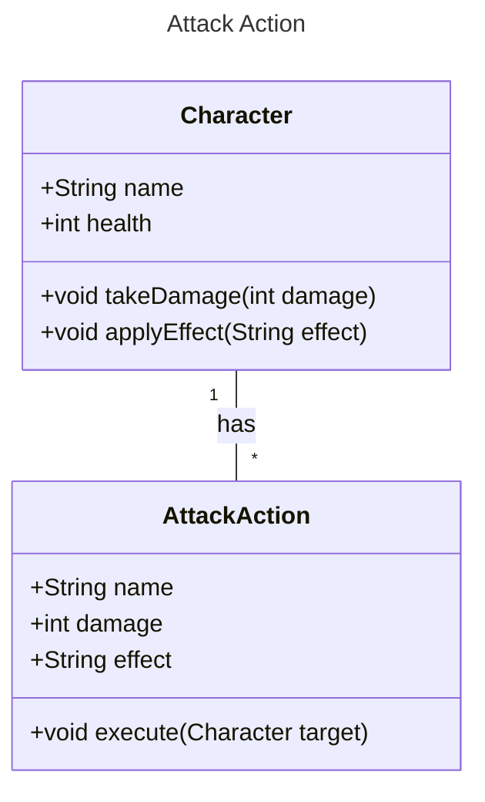

```mermaid
---
title: Attack Action
---
classDiagram
    class AttackAction {
        +String name
        +int damage
        +String effect
        +void execute(Character target)
    }

    class Character {
        +String name
        +int health
        +void takeDamage(int damage)
        +void applyEffect(String effect)
    }

    Character "1" -- "*" AttackAction : has
```
