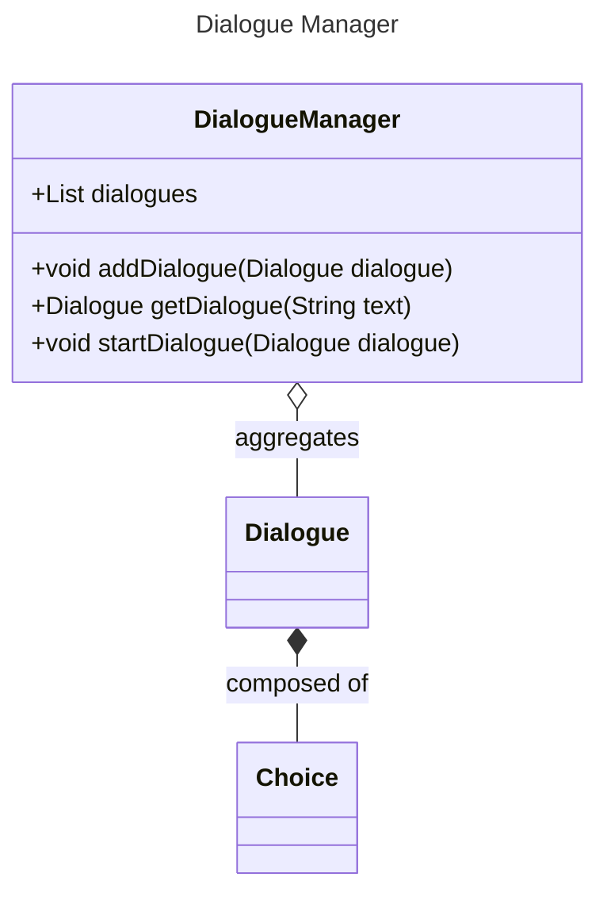

```mermaid
---
title: Dialogue Manager
---
classDiagram
    class DialogueManager {
        +List<Dialogue> dialogues
        +void addDialogue(Dialogue dialogue)
        +Dialogue getDialogue(String text)
        +void startDialogue(Dialogue dialogue)
    }

    class Dialogue {
    }

    class Choice {
    }

    DialogueManager  o--  Dialogue : aggregates
    Dialogue  *--  Choice : composed of
```
