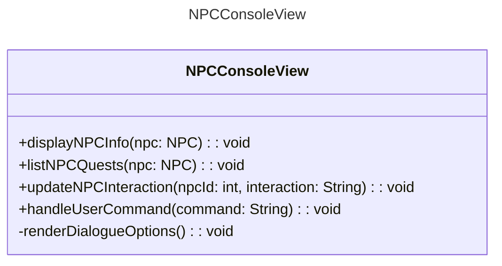

```mermaid
---
title: NPCConsoleView
---
classDiagram
    class NPCConsoleView {
        +displayNPCInfo(npc: NPC): void
        +listNPCQuests(npc: NPC): void
        +updateNPCInteraction(npcId: int, interaction: String): void
        +handleUserCommand(command: String): void
        -renderDialogueOptions(): void
    }
  
```
