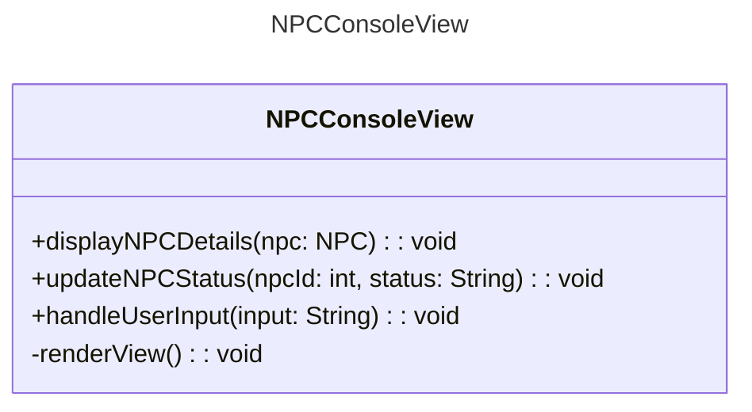

```mermaid
---
title: NPCConsoleView
---
classDiagram
    class NPCConsoleView {
        +displayNPCDetails(npc: NPC): void
        +updateNPCStatus(npcId: int, status: String): void
        +handleUserInput(input: String): void
        -renderView(): void
    }
  
```
