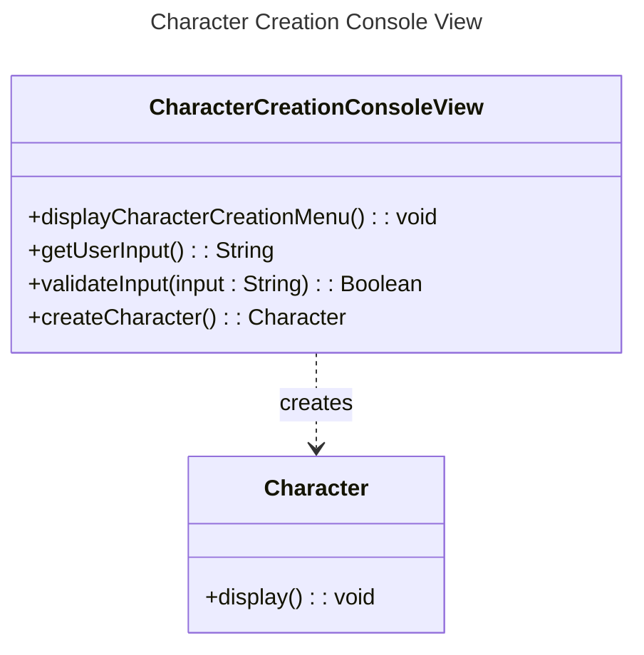

```mermaid
---
title: Character Creation Console View
---
classDiagram
    class CharacterCreationConsoleView {
        +displayCharacterCreationMenu() : void
        +getUserInput() : String
        +validateInput(input : String) : Boolean
        +createCharacter() : Character
    }
    
    class Character {
        +display() : void
    }
    
    CharacterCreationConsoleView ..> Character : creates

```
