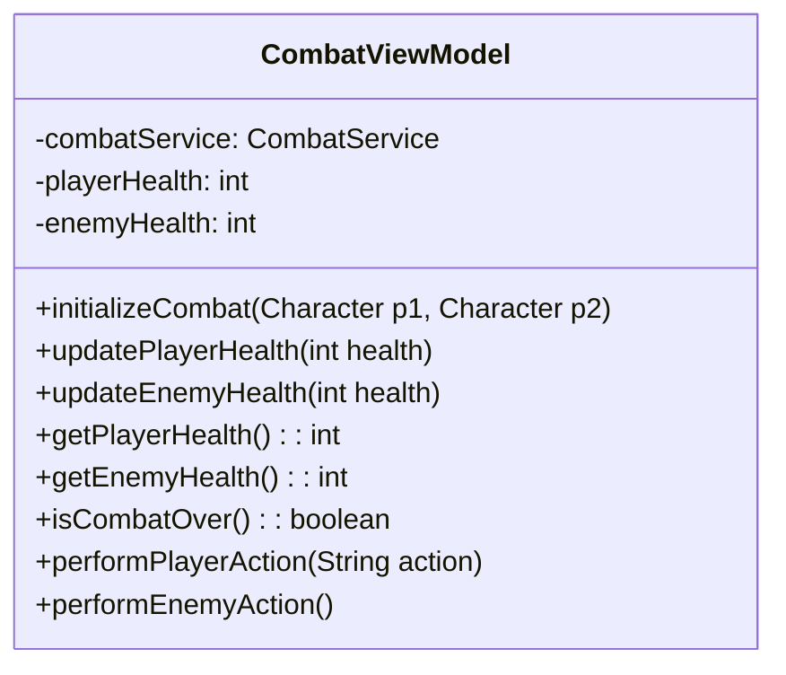

```mermaid
classDiagram
    class CombatViewModel {
        -combatService: CombatService
        -playerHealth: int
        -enemyHealth: int
        +initializeCombat(Character p1, Character p2)
        +updatePlayerHealth(int health)
        +updateEnemyHealth(int health)
        +getPlayerHealth(): int
        +getEnemyHealth(): int
        +isCombatOver(): boolean
        +performPlayerAction(String action)
        +performEnemyAction()
    }
```