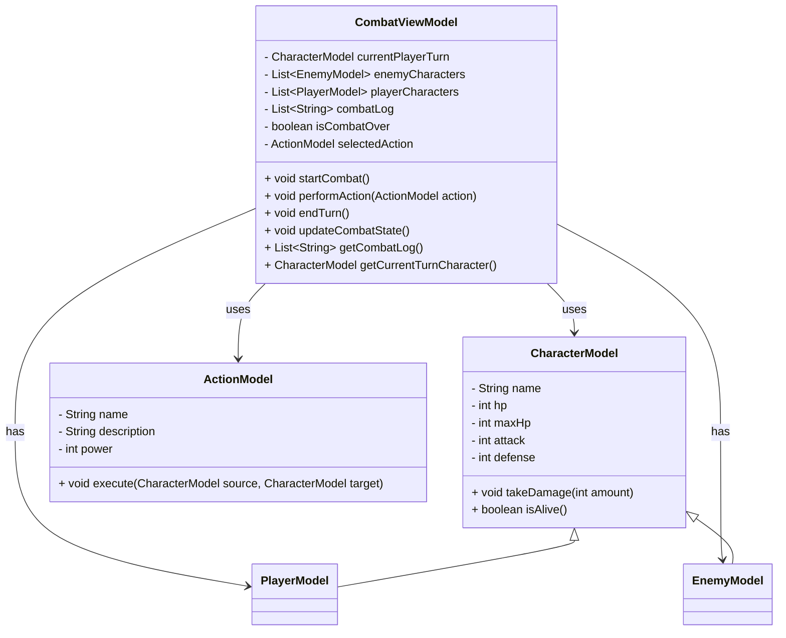

```mermaid

classDiagram

class CombatViewModel {
  - CharacterModel currentPlayerTurn
  - List~EnemyModel~ enemyCharacters
  - List~PlayerModel~ playerCharacters
  - List~String~ combatLog
  - boolean isCombatOver
  - ActionModel selectedAction
  + void startCombat()
  + void performAction(ActionModel action)
  + void endTurn()
  + void updateCombatState()
  + List~String~ getCombatLog()
  + CharacterModel getCurrentTurnCharacter()
}

class CharacterModel {
  - String name
  - int hp
  - int maxHp
  - int attack
  - int defense
  + void takeDamage(int amount)
  + boolean isAlive()
}

class ActionModel {
  - String name
  - String description
  - int power
  + void execute(CharacterModel source, CharacterModel target)
}

CombatViewModel --> CharacterModel : uses
CombatViewModel --> ActionModel : uses
CombatViewModel --> EnemyModel : has
CombatViewModel --> PlayerModel : has
CharacterModel <|-- PlayerModel
CharacterModel <|-- EnemyModel

```
