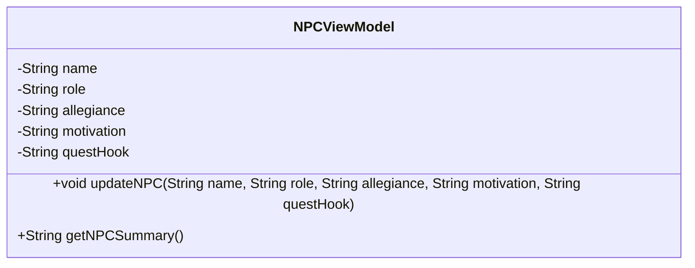

```mermaid

classDiagram
class NPCViewModel {
    -String name
    -String role
    -String allegiance
    -String motivation
    -String questHook
    +void updateNPC(String name, String role, String allegiance, String motivation, String questHook)
    +String getNPCSummary()
}

```