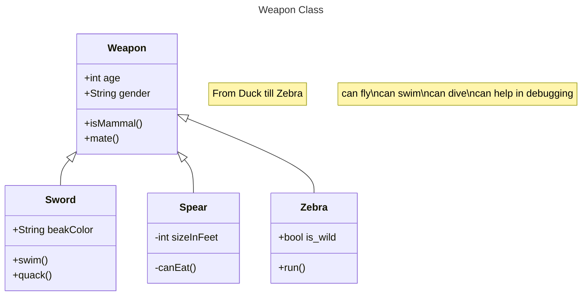

```mermaid
---
title: Weapon Class
---
classDiagram
    note "From Duck till Zebra"
    Weapon <|-- Sword
    note for Duck "can fly\ncan swim\ncan dive\ncan help in debugging"
    Weapon <|-- Spear
    Weapon <|-- Zebra
    Weapon : +int age
    Weapon : +String gender
    Weapon: +isMammal()
    Weapon: +mate()
    class Sword{
        +String beakColor
        +swim()
        +quack()
    }
    class Spear{
        -int sizeInFeet
        -canEat()
    }
    class Zebra{
        +bool is_wild
        +run()
    }
```