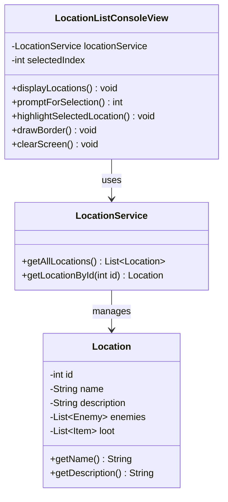

```mermaid
classDiagram
    class LocationListConsoleView {
        -LocationService locationService
        -int selectedIndex
        +displayLocations() void
        +promptForSelection() int
        +highlightSelectedLocation() void
        +drawBorder() void
        +clearScreen() void
    }

    class LocationService {
        +getAllLocations() List~Location~
        +getLocationById(int id) Location
    }

    class Location {
        -int id
        -String name
        -String description
        -List~Enemy~ enemies
        -List~Item~ loot
        +getName() String
        +getDescription() String
    }

    LocationListConsoleView --> LocationService : uses
    LocationService --> Location : manages
```