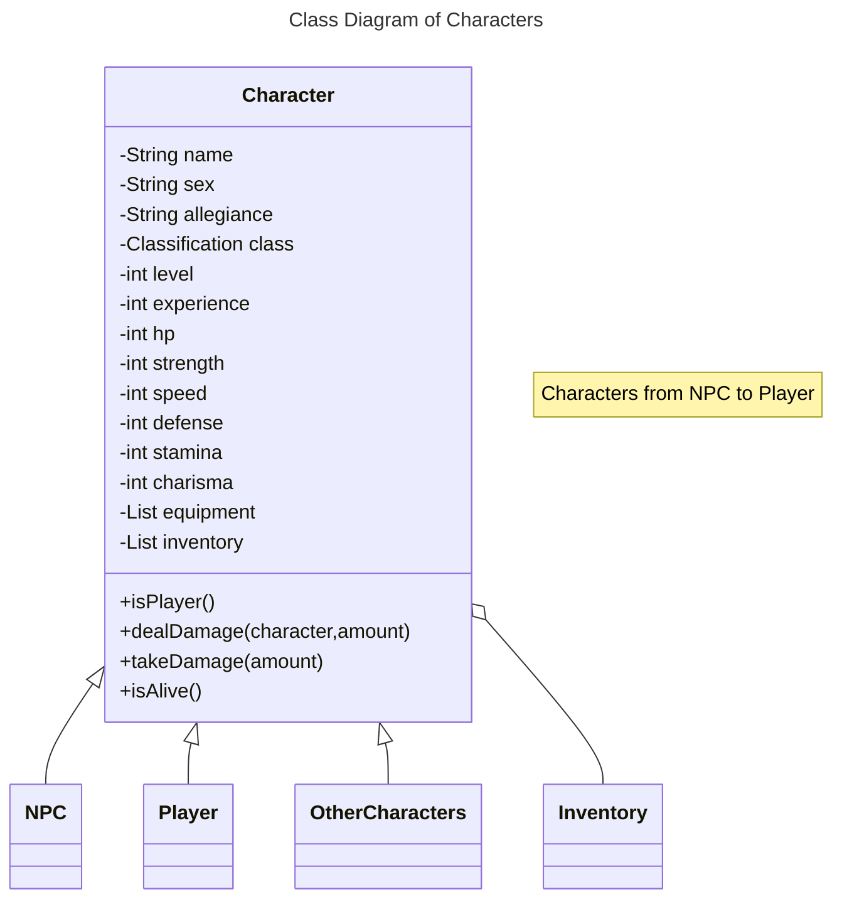

```mermaid
---
title: Class Diagram of Characters
---
classDiagram
    note "Characters from NPC to Player"
    Character <|-- NPC
    Character <|-- Player
    Character <|-- Other Characters
    Character o-- Inventory
    Character : -String name
    Character : -String sex
    Character : -String allegiance
    Character : -Classification class
    Character : -int level
    Character : -int experience
    Character : -int hp
    Character : -int strength
    Character : -int speed
    Character : -int defense
    Character : -int stamina
    Character : -int charisma
    Character : -List equipment
    Character : -List inventory<list>
    Character : +isPlayer()
    Character : +dealDamage(character,amount)
    Character : +takeDamage(amount)
    Character : +isAlive()

    
```