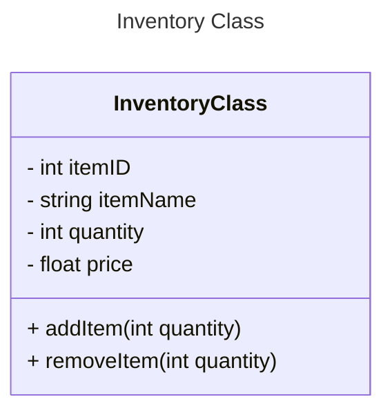

```mermaid
---
title: Inventory Class
---
classDiagram
    class Inventory Class{
        - int itemID
        - string itemName
        - int quantity
        - float price
        + addItem(int quantity)
        + removeItem(int quantity)
}
```

