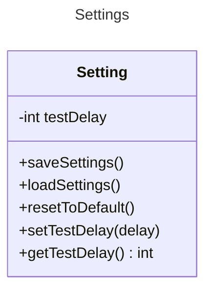

```mermaid
---
title: Settings
---
classDiagram
    class Setting {
        -int testDelay
        +saveSettings()
        +loadSettings()
        +resetToDefault()
        +setTestDelay(delay)
        +getTestDelay() int
    }
```
