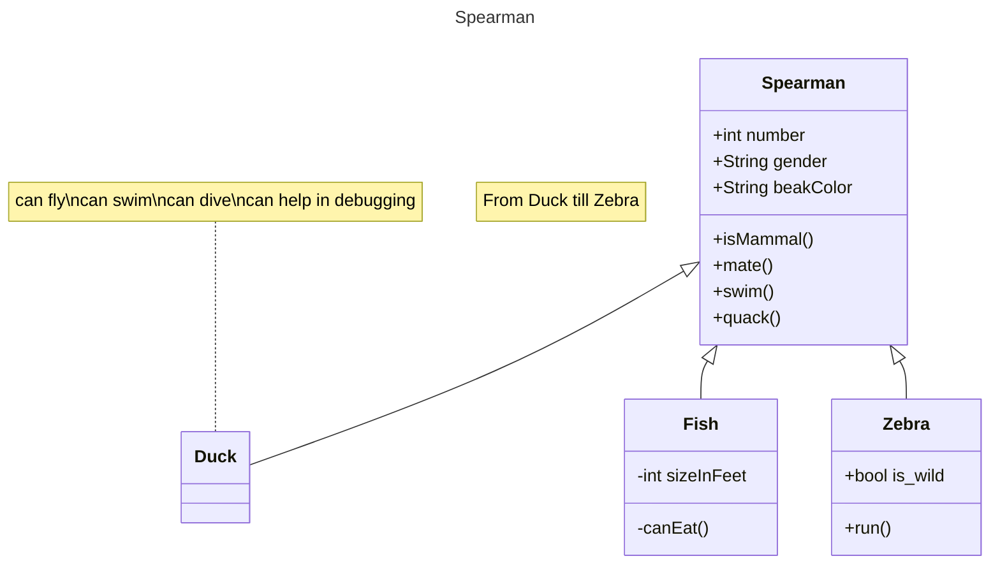

```mermaid
---
title: Spearman
---
classDiagram
    note "From Duck till Zebra"
    Spearman <|-- Duck
    note for Duck "can fly\ncan swim\ncan dive\ncan help in debugging"
    Spearman <|-- Fish
    Spearman <|-- Zebra
    Spearman : +int number
    Spearman : +String gender
    Spearman: +isMammal()
    Spearman: +mate()
    class Spearman{
        +String beakColor
        +swim()
        +quack()
    }
    class Fish{
        -int sizeInFeet
        -canEat()
    }
    class Zebra{
        +bool is_wild
        +run()
    }
```