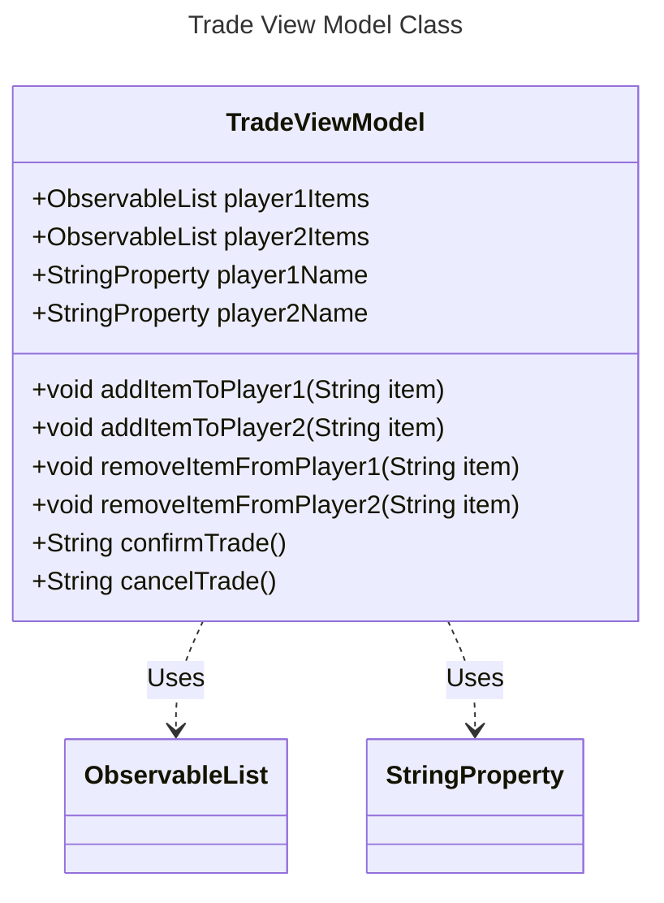

```mermaid
---
title: Trade View Model Class
---
classDiagram
    class TradeViewModel {
        +ObservableList<String> player1Items
        +ObservableList<String> player2Items
        +StringProperty player1Name
        +StringProperty player2Name
        +void addItemToPlayer1(String item)
        +void addItemToPlayer2(String item)
        +void removeItemFromPlayer1(String item)
        +void removeItemFromPlayer2(String item)
        +String confirmTrade()
        +String cancelTrade()
    }

    TradeViewModel ..> ObservableList : Uses
    TradeViewModel ..> StringProperty : Uses
```
