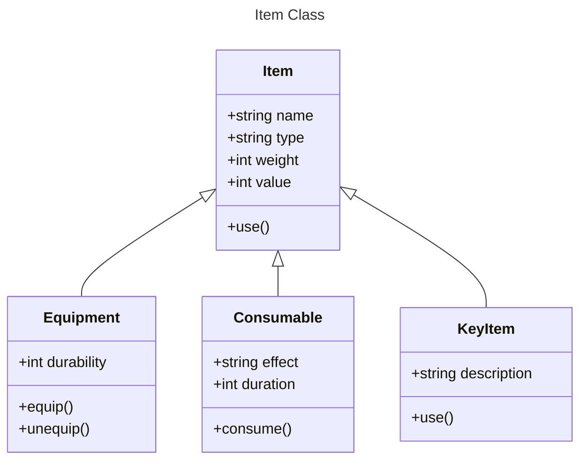

```mermaid
---
title: Item Class
---
classDiagram
    class Item {
        +string name
        +string type
        +int weight
        +int value
        +use()
    }
    class Equipment {
        +int durability
        +equip()
        +unequip()
    }
    class Consumable {
        +string effect
        +int duration
        +consume()
    }
    class KeyItem {
        +string description
        +use()
    }
    Item <|-- Equipment
    Item <|-- Consumable
    Item <|-- KeyItem
```