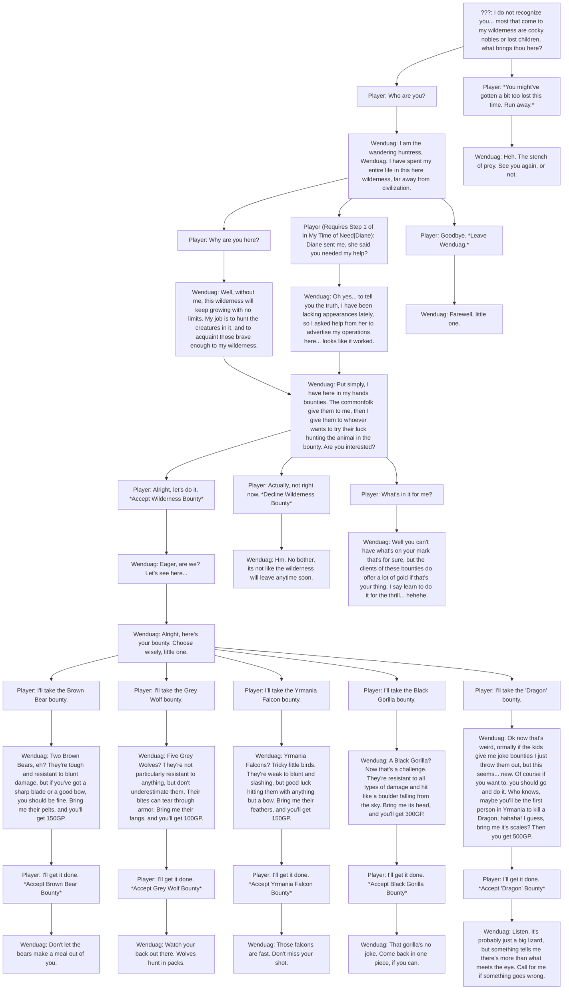
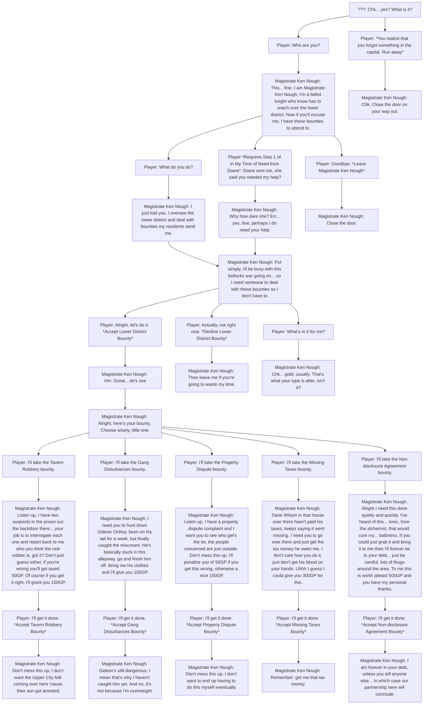

# Main Quest

## **Prologue/Quest 1: "Reawakening"**

It’s noon, and you have just been assigned a task. Usually, you finish tasks as quickly as they have been given, but It’s hectic out there, and sometimes you need a little drink. What could go wrong?

### **Scene 1**

You wake up in the tavern feeling like maybe a bit too drunk. As you try to pick yourself up, a man rushes into the tavern and screams, “The Legion is here!”. Everyone inside the tavern hurriedly rushed outside the tavern as if their lives mattered on it. “Who’s the Legion?”, you asked yourself. Nevertheless, you groggily dragged yourself out of the tavern and your eyes widened. An attack is happening in the village. Houses on fire and bodies scattered. A bloody sword lies in front of you and two people are fighting each other. You pick up the sword and try attacking one of them, but your eyes fail you and you see a blurry mess.

What will you do?

- **1.** Attack the person who seems to be wearing leather armor – attacking him means siding to the Legion

You attacked the armored person and assisted him. The robed person mutters something in another language, but before you try to understand it, you get hit in the back of your head by something.

- **2.** Attack the person who seems to be robed – attacking him means defending the village

You attacked the robed person and successfully defeated the robed person. “You have my thanks.”, said the armored person. But before you could say any words, the person shouted, “Look out!” before being hit in the back of your head by something.  

**Whatever the choice of the player picks, it will always end up in them being hit in the head.**

You try to open your eyes, but you can only see glimpses. You seem to be being carried by someone. You try to talk, but nothing comes out of your mouth. Your vision fades away.

### **Scene 2 (Character Creation)**

You wake up in a hospital. You are surrounded by wounded people being tended. A doctor notices that you have woken up and asks how you are feeling.

- **1.** “I feel… alright.” – the doctor responds that you’re very lucky as your head injury is very fatal, yet you lived.
- **2.** “I am awake, so…” – the doctor responds to your humor well, saying that even in a fatal condition, you manage to crack a joke.
- **2.** Remain Silent – the doctor assures that everything may be a bit confusing thanks to your head injury.

The doctor asks what is your name. You try to say it, but you somehow can’t. But still, you try to mutter something that resembles a name.

**This part is where the character will type their name**

You didn’t know if it was your name or someone, but it’s who you are for the time being.
The doctor then picks up a mirror and shows it to you. You see a figure, but you don’t know who it is.

**This is the part where the player makes their character**

You aren’t certain if what you see in the mirror is really you or not, but it’s who you are now.
The doctor hypothesized that the injury may have made you amnesiac. But that doesn’t matter. What matters is that you survived, and he thanks the person that carried you to the hospital whoever they may be. In the meantime, the doctor releases you from the hospital. He asks you to try exploring. Maybe you can remember something from exploring the place.

### **Scene 3**

You are now outside the hospital and are now free to roam and explore. Everyone seems to be busier than usual, especially the number of soldiers marching outside the capital.

**The player is now free to roam around and ask people about the situation**

- **NPCs will answer the following:**
	- **The soldiers are because of the invasion of the Legion of Ahmed into the state**
	- **The amount of people as refugees from the war**
	- **Some saying that you are the first to be released from the hospital**
	- **Some being shocked from the bandages in your head**

**Only one NPC will continue the quest. The NPC will continue the story**

Someone catches your attention. It is a person carrying a box. He seems to recognize you, but you don’t.
He puts down the box and asks where you’ve been, and he notices your bandages. “Oh no, have you got yourself in a mess laddie?”.

- **1.** “I did, but I don’t seem to remember much.” – he tries to take it as a joke, but he realizes you are not kidding.
- **2.** “Nope, I just tripped over. You know, very normal injuries.” – he laughs, but the severity of your injuries says nonetheless, and he becomes worried.
- **3.** “Who are you, and where am I?” – he becomes worried about the state of your condition.

“Don’t you remember? It's me! The guy who delivers equipment to your shop every day!”. But you don’t seem to remember. He sighs and accepts the situation that you have forgotten everything. Someone from his job taps into his shoulder, and he hurriedly tries to explain to you where you are right now. He suggests that you try going to your job in hopes that you can remember something. He gives you the direction to take and bids you farewell.

With the directions given you try to get to the place, but groups of people block your way. It seems to be a charity service being done by a religion asking for the people who have the capacity to be a warrior join the militia in aid of the defense of the state. They are also asking for donations of provisions to aid injured people and such. You try finding another way to the place by going through a narrow pathway

Suddenly, a menacing armored person confronts you halfway through the narrow pathway. “You”, he says in an authoritative voice, pointing his sword at you. “You’re the one who barely survived the attack at the village”. “People around here have been talking. That you have been very lucky. But me? I think you’re more than lucky. You have been chosen to be in a bigger role than you can imagine.” He plants his sword in the ground. “Meet me in the Pilgrimage Site. We will discuss this further when the time comes.” You hear a commotion behind you, and the moment you look back, the person disappears.

### **Scene 4 (Class Creation)**

Emerging from the pathway, you see the barracks in front of you. A person recognizes you from the barracks and immediately grabs you. “No time to waste! You’re already behind schedule!”. He takes you into the barracks and puts you into a room full of weapons and armor. “For someone who has an important task, you sure are late! Here, choose whatever you want or need. You are going to need it for that task. Not to mention, a lot of volunteers have been draining the barracks of equipment”. You hear something outside and the person immediately screams, “Give me a moment, I’m coming!”, storming outside in a hurry.

**This is the part where the player can choose their class**

You pick up everything you need and the person comes back. “Oh good, you’re all ready. Now, leave. I still have a lot of things to tend to.” Another commotion happens and he screams at the door. “WILL YOU PEOPLE WAIT YOUR TURN”. Before any trouble begins, you immediately leave the barracks and continue your task of finding the place.

### **End of Prologue/Quest 1**

## **Quest 2: "Once Again"**

### **Scene 1:**

From the barracks, you see the way towards the place has been cleared. You continue your walk. You encounter a very busy place full of parchments and such. It seems that you’re in a courier service.

**The player is free to ask NPCs.**

- **NPCs will answer the following:**

	- **The parchment being letters**
	- **Some of the boxes being packages**
	- **Ever since the war, the service has been in disarray**

**Interacting a certain NPC (Keeper) one will progress the quest**

The keeper recognizes you and asks you about your current task. This confuses you but confirms that this place is indeed where you work.

- **1.** “Can you please remind me what it is again?” - the keeper says it’s an important one
- **2.** “Oh yeah, the task. Uhh, what was it again?” - the keeper rolls their eyes and says it’s an important task.
- **3.** “What task?” - the keeper is confused but she reminds you it’s important.

A crowd of people exclaims for you to wait your turn. The keeper is seen to be exhausted to be angry but she gives you directions to the person who assigned the task.

Inside the busy building are piles of unsorted piles of parchment being sorted by only a handful of people. A door can be seen at the end of the building and you enter.

A woman greets you and asks you how the delivery went. You shake your head and shrug. The woman notices the injury in your head and becomes concerned. She deduces that you may have forgotten your task thanks to the injury so she explains it in secrecy. But before that, she made sure that no one outside the door may be listening.

“You have an important task given upon you. A letter and a package sent by the queen herself. You were supposed to meet with someone to get the package from the village, but everyone said that the village was attacked.”

She asks you if you still have the letter and the package, but you don’t remember the doctor giving you anything. She sighs in worry, but she immediately composes herself.

“I do not know how to help you, but I suggest you start with the people who helped you here. Perhaps the doctor who tended to you.”  She presents a crest. “You almost forgot this, but it’s a miracle you did. You need to present this alongside the letter.”

A knock is heard from the door. She stands and acknowledges. “You may go, good luck”.

### **Scene 2:**

You exit the door and went outside the building. You remember something about the doctor saying about someone carrying you to the hospital. They may know something.

You go back to the hospital and find the doctor. You ask if they know the whereabouts of the person who carried you back here.

The answer may depend on what choice you have picked on who to attack in the prologue

- **Attack Armored Person** - the doctor says that the person who was carrying you was one of the invading force and is now on the chopping block. Though you can find him in the prison as the beheading is still in the later afternoon.
- **Attack Robed Person** - the doctor says that the person has been recently released from the hospital and can be found in the barracks.

You go to the person who saved you earlier. You thank them and ask if they saw something from them being taken before they found you.

They explain that there was someone who took the package from you discreetly. Though it looked like one of them wore the emblem of the Caravan Company.

**If the player saves the robed person, they will invite the player to The Legion of Ahmed, giving him a keyword that grants him to enter the encampment near the village.** 

- **SPECIAL EVENT** 
	- The Legionnaire will insist on staying in the cell as, in his own words, “My part is not yet in play.”. Guards immediately approach and unlock the cell to escort the prisoner. He stops and looks at you. “You have proven yourself worthy of The Prophet. But the question remains. Are you simply His audience, or will you be part of the grand play?”. He then resumes his walk with the guards to the outside of the prison.

### **Scene 3:**

You exit out of the building and see a crowd of people gathering somewhere.

- **Asking the NPCs will answer the following:**
	- **An execution is said to be happening**
	- **It’s a captured Legionnaire from the Legion of Ahmed**
	- **Something is said to be happening, so they went along**

You follow along the crowd to the plaza and see the Legionnaire alongside a couple of guards and an executioner on a wooden platform. The Legionnaire is bound on a pillory. The crowd throws debris at the Legionnaire whilst being called names and such. “This state’s salvation is at hand! The Prophet alongside his disciples will cleanse the lands of weakness, and from the ashes, a state pure and free from corruption will arise!”, shouted the Legionnaire. The crowd boos the Legionnaire but you can feel a change of emotion in the air. It is anger, with a tinge of fear. “Worry not! We will all be free of suffering by His will! Long live the prophet! Long live the Legio-”. Before the Legionnaire finishes his last words, the executioner’s axe swiftly cuts down his neck followed by a thud on the platform. The Legionnaire is dead, and the crowd angers still. You immediately leave the plaza, and focus on the matter on your hand.

### **End of Quest 2**

## **Quest 3: "Finders Keepers"**

### **Scene 1:**

The player can ask around the town whether they know something about the Caravan Company.

- **The NPCs will answer the following:**
	- **They’re a private company**
	- **They’re the ones who handle discreet operations**
	- **They’re usually very hard to find**

**Talking to all the NPCs will progress the quest. The final NPC will give the player a big hint:**

- “If you saw someone who bears their emblem, they’re probably nearby”

You remember that the person who carried you to the hospital said something about someone discreetly taking something from you when you were unconscious.

With knowledge of the mysterious Company, you venture out of the capital to investigate even further. Starting with their last known appearance: Wuthering.

You immediately went to the village, hoping that you would find any clues.

### **Scene 2:**

### **Wuthering:**

You return to the town where the invasion began. Wuthering. Once it was a town of life. Now, it's a charred mess of buildings and mounds of corpses. A town of lifelessness and death. You can see survivors weeping and children wandering around calling for their mothers and fathers.

- **Asking NPCs in the area will answer the following:**

	- **The Legion burned the place to the ground**
	- **Where was Thomasia when the village fell (I hope someone gets this)**
	- **It’s now dangerous around here now that the Legion’s encampment is set nearby.**

**Only one NPC will progress the quest.**

You see the tavernkeep kneeling over a burning building. He immediately recognizes you from before the attack while you were very drunk.

You ask him if he remembers what you did before you got drunk and were you carrying anything before the attack. He tries and remembers that you were meeting with someone in the tavern before getting knee-deep in the mead. He also remembers that you were carrying what looks like a courier’s bag before dragging yourself out of the tavern. He exclaimed and apologized that amidst the chaos, he cannot help you get to safety.

- **Asking him about the Caravan Company will lead you to the direction of these 3 places:**
	- **Thomasian Pilgrimage Site**
	- **Summonwater Village**
	- **Heretic’s Tower**

He will also give you the emblem as he found it somewhere in mud while the village was still being attacked.

You thank the tavernkeep and continue your journey.

**The Player is now open to explore anywhere. Though some can only be entered whenever they have done a particular task such as saving the Legionnaire in the Prologue giving you access to the Legion of Ahmed’s Encampment, or when the story permits them to.**

**For now, the player can only visit the three places where the caravan can be found.**

- **The caravan can be found once in these three places at random:**
	- **Somewhere in the Thomasia Pilgrimage Site**
	- **Summonwater Village**
	- **Outside of Heretic’s Tower**

**Though the player will not know where they actually are unless they ask around the places.**

### **Thomasia Pilgrimage Site:**

You visit the site in hopes that you will find a trace of the Company.

The Thomasia Pilgrimage Site. People often believe that pilgrimage is one of the ways to show your faith to a religion. “To strengthen the bond with your god,” you must go on a long and arduous journey to sacred sites. This is one of them, but you’re here for something else.

You always thought that these sites are not that crowded, but you guessed wrong. You can’t discern between people of Thomasian and people who are not. Ever since the start of the wars, people have been flocking to pilgrimage sites to prove that they are worthy of the love of their god. That, or they are just scared of the punishment that the other religions are carrying out to those who don't have one.

- **Asking the NPCs will answer the following:**
	- **Their journey to this site has been very arduous especially since the start of the wars**
	- **They’re here to “prove their fate”, but it can be seen that they are only doing it to avoid punishment.**

**The last NPC asked will continue the quest**

You asked a follower of Thomasia if they have seen anyone who bears the emblem of the Caravan, while also showing the emblem itself

**If the Company is in this place, proceed to the bottom portion of the quest after the Outside of Heretic’s Tower. If not, continue.**

She says that she saw a caravan going in the direction of Summonwater and Heretic’s Tower. Other than that, she didn’t see anyone as of now bearing the emblem and apologized.

You thank her and continue your task to find the Company.

### **Summonwater Village:**

You enter the village in hopes that you will find a trace of the Company.

Upon entering the village you expect it to be bustling with people only to be met with empty stalls and militia wandering around the roads. “Where have they all gone to?”, you ask yourself.

- **Knocking on doors will give you the following answers**
	- **They will ask if it’s safe to go outside now**
	- **They will shoo the player away**
	- **They will ask if you are a wandering seller**

**A local militia will approach you and continue the story.**

A local militia took notice of your disturbance to the people and asked you your business. You answer that you’re confused about what is happening and where the people are. She answers that the town has been paranoid ever since the attack on the neighboring village and has been mandated to stay in their houses for the time being.

You pull the emblem out of your pocket and ask her if she saw anyone who bears the emblem of the Caravan.

**If the Company is in this place, proceed to the bottom portion of the quest after the Outside of Heretic’s Tower. If not, continue.**

She says that she saw a caravan stop by earlier but didn’t know where they went. She hypothesizes that they may have gone to the direction of the Pilgrimage Site or the Heretic’s Tower.

You thank the soldier and she returns to her post. You continue your task of finding the Company elsewhere.

### **Outside of Heretic’s Tower:**

You enter the area of the infamous Heretic’s Tower in hopes that you will find a trace of the Company.

This place is said to have a dark history behind it. No one knows why and how it came to be, but it is advised to stay away from the building itself. Nevertheless, you entered the grounds of the infamous tower.

You see a small group of militia guarding the area of the tower itself. Who would’ve thought that this place is still being guarded? It does raise some questions but you focus on the task instead.

- **Asking the NPCs will answer the following:**
	- **The tower is off limits**
	- **No, they do not know the history behind this tower too**

**After exhausting the dialogue options, the story will continue**

You ask the militia if they have seen someone who bears the emblem you are currently showing.

The militia points to their scout.

**If the Company is in this place, proceed to the bottom portion of the quest after the Outside of Heretic’s Tower. If not, continue.**

The scout answers that they have not seen anyone nor have they encountered anyone who bears the emblem. Though she notes that she saw what looks like a caravan going in the direction of Summonwater and the Pilgrimage Site.

You thank the scout but before you can leave she stops you and asks for her payment. Though she immediately says that it was a joke and you continue your business finding the Company.

**If the Caravan Company is in the vicinity:**

She remembers someone passing by who bears the symbol. They point the direction of where the person went and you immediately follow.

### **Scene 3:**

The place points to a somewhat vegetated area covered by trees and bushes. They do not excel in hiding that well, kind of, but they are a service. You can’t offer your services if no one can find you, can they now?

Emerging from the bushes, you see tents set up alongside horses. A person comes out of the tent that bears the emblem of the Company. You immediately deduced that you have found the Company. The question now is: Will they comply, or will you have to force it out of them?

You wait until the cloaked figure exits the vicinity and you discreetly enter the tent.

You see a small table with a map in the middle. From the table, you see someone rummaging through documents.

You get his attention and he immediately snaps at you. “Oh, a new customer. You have pretty keen senses for someone who can find us. So, how can we help you? Do you need to acquire something from someone? Peruse our catalogs? Or something else that you have in your mind?”. You ask the person for a package. “A package? You must’ve confused us for a courier service.”

- **The player can now choose how they will get the information:**
- **State your purpose - a secret to a secret organization. You say that you’re here to retrieve a package sent by the Queen herself. The person laughs and belittles you for your embarrassing attempt. Although the person’s emotion changes upon showing the crest. He immediately becomes scared and tells you what he knows.**
- **Threaten the man - you threaten the man by readying your weapon at him. He laughs at you and calls his guards. “Let’s take this outside. Can’t let you damaging my business and assets now, would I?”. This initiates a combat sequence. After being dealt enough damage, the guards will run away and leave the man alone for questioning.**
- **Bribe the man - you comb through your pockets and present a hefty sum. The man’s eyes brighten and show a big, shin-eating grin. The man will answer any of your questions.**

The man explains everything to you. “We took care of the package, indeed. Even the process of procuring it all thanks to this whole Legion thing. What’s even better is you drowning in your own fairytale land. Though, if I only have the package on my hand right now, then you’ll be happy no? But no, just a tad too little too late. Tell me, how well can you chase someone?”. You immediately remember someone exiting the tent earlier. The man confirms that the person indeed has the package and you immediately run after the person.

### **End of Quest 3**

## **Quest 4: "Small Importances"**

### **Scene 1:**

Immediately after emerging from the bushes, you see the person going into Summonwater village and immediately give chase. If this man gets away now, you won’t be able to get the package.

The man immediately notices you and sprints towards the alleys in hopes of losing you.

- **This is now a chase sequence. A player is given a choice to follow the man directly or to take a detour in hopes of catching up. The player can choose between two options:**
	- **Keep chasing him - the man is right then and there. Just keep running after him. The only question is: which legs will fail first, yours or theirs?**
	- **Find a detour to close the gap - check whether there is a possible detour on the way. If luck is on your side right now, it could close the gap. Or widen it.**

**The chase will and always end in you cornering the man, but taking a detour will either give you a boost, or slow you even further.**

### **Scene 2:**

Eventually you corner him into an alley. Both of you are gasping for air from the exhaustion, but the man eventually catches their breath. “Y-you… don’t know… *gasp* what you’re doing.” He grabs something from behind him. “Listen, kid, turn back. What you’re trying to get back is something far more important than you can imagine.” He unsheathes something. “Turn around right now and tell whoever you’re serving right now that you’ve lost this thing, walk away from it.”

You declined the offer, and he reveals two daggers. “Don’t make me do this.”.

**The player is now in a combat encounter. Whatever happens, the man will surrender and will never die.**

### **Scene 3:**

In the middle of the fight, the package is damaged. Out flies a key into the muddy grounds of the alleyway. The man is on the ground and drops his daggers. “Take it. I don’t want to take any part in this.” You pick up the damaged package with the letter and the muddied key and immediately clean it. It is a strangely heavy key decorated with an emblem and is inscribed with words. You pocket it immediately and leave the alleyway. “Hey, before you go.”, says the man behind you. “I can’t change your mind on this whole matter, but he can.” You stopped and listened to the man. “Fort Farroth, a man who goes by Nik. When you find him, tell him 'a knight in the gallows'. "

Curiosity consumes you. This key, sent by the queen herself, holds something more than it looks like. Why would a key be this important? Better yet, why would anyone want it? For only a little gold? The man who was keeping it looked like they were protecting it with their life but they stopped and gave it to you in hopes of you understanding. There is certainly something going on, and you must uncover it.

You now set your destination to Fort Faroth.

### **End of Quest 4**

## **Quest 5: “...To Rule Them All”**

### **Scene 1:**

From a distance you see a small castle-esque building with what seems like lines upon lines of soldiers marching from it. There is no mistake, it is Fort Farroth. And it seems that the state is acting on the advance of the Legion. You head on inside.

Upon entering the fort, you are greeted with countless soldiers training for combat and archery with great effort for the defense of their beloved state. Hundreds of weapons stationed in racks constantly being tended by their owners and armors being tempered by the local blacksmith.

**The player can now ask around to find the person they are looking for.**

- **The NPCs will answer the following:**
	- **They haven’t heard of anyone named Nik**
	- **They used to have a Nik around, until an arrow took their knee and died in battle**
	- **“Nik? Like a nick in the sword or something?”**

**Exhausting their dialogue will proceed to the next scene.**

### **Scene 2:**

Suddenly, a heavily guarded group comes out from the interiors of the fort bearing a different set of attire from what you normally see. It seems to be councillors from different regions. You overhear their conversation.

“Finally, the state has made a move upon this matter. A state that is neutral is one to behold! Especially in these grim times, but sometimes a sacrifice in pride must be made for the greater good. That high and mighty sage is a hard nut to crack but the Legion’s advancements made it possible. Of course, it was only a matter of time before Old Sage Nik caves in.”

Your ears prick up. Is this the man who was meant to receive the package?

You immediately walked to the entrance inside the Fort before being stopped by the guards. “State your purpose”, says the left guard.

- **The player can choose what to do:**
- **State their purpose - you state that you have something for the sage. “The High Sage has been expecting you.” They lower their spears and let you enter.**
- **Ask if Old Sage Nik is inside - “Who is asking?” says the right guard. You respond by saying that you are a courier who is supposed to deliver something for him. They lower their weapons and they let you enter.**
- **Present the damaged package - they immediately inspected the package and they see an emblem from the queen. They lower their weapons and let you enter the fort.**

### **Scene 3:**

You see a group of people surrounding a table discussing with each other. They immediately leave and you see an old man at the center of the table. You hypothesized that this man is the one who you're looking for and approached him.

You approach the old man and immediately get his attention. He asks you to state your purpose as he has a lot of things to do. You mutter the words “A knight in the gallows” and he immediately looks around. “Not here, follow me”. He stands up and you follow him into a room.

In the room, you show the key and he asks you to give it to him. You retract your arm and state that you are the original courier of the key and ask why he orchestrated the whole ordeal.

“So, you are the man who has been tasked to the key. You have all the reason to give it back to the queen, but I can tell that you have a lot of questions on your mind. The purpose and the gravity of this little key right?”

He offers you a seat, and he expounds on its use. He doesn’t know the true use of the key except one. To anyone the key is nothing, but it controls something far more important. The state itself. He originally took if from you to safekeep if from anyone, even the queen herself. If it falls to the wrong hands, even if it is the state itself, it can spell doom to the inhabitants of the state itself. He tells you that he has a lot in his hand and he doesn’t want to draw attention, but he knows where to start to know the true purpose of the key. He gives you directions to a museum in the capital. “There, you must find something that carries the symbol and the words of the key, it will guide you to the answer. And as always, ‘a knight at the gallows’ is the keyword.” He opens the door and you follow him.

Instead of insisting on you giving him the key, he lets you keep it. “You are the one who is supposed to deliver it after all”, he said and returned to his usual activities.

You set your next destination to the museum in the Capital.

### **End of Quest 5**

## **Quest 6: “Of Symbols and Ciphers”**

### **Scene 1:**

You went back to the capital and followed the directions of the Old Sage. Upon arriving you were surprised that the building that greets you is a tavern instead. You ask around in confusion and everyone answers that the building WAS a museum. The owner couldn’t raise enough money to keep the building so the man who owns the tavern, well, owns it now.

### **Scene 2:**

You enter the inn and are greeted by the smell of food and mead in the air. It’s a tavern alright, and it’s packed with people. You take a seat and ask the barkeeper and he asks you what you want. You answer the keyword and the barkeeper calls for someone. A girl comes by and the barkeeper whispers something to her. He asks you to come with him. You follow him into the back of the tavern, where barrels of alcohol and the likes are stored. He points to a specific spot in the room and you look closer.

It’s an old, normal-looking pipe. What’s different with it is that it bears the same emblem in the key though on a much smaller scale, looking like a metalwork company’s emblem. The barkeeper hypothesized that this pipe has been present when the museum was still standing. The Old Sage’s man took notice of this and asked the barkeeper to keep it a secret for now. You feel like following this pipe may lead you closer to the answer but this may prove to be a harder task.

You remember that this used to be a museum, maybe the old owner knows something about the pipe. You ask the barkeeper if he knows where the old owner lives and gives you directions. You exit the tavern and find the old owner.

### **Scene 3:**

You stop by a semi-dilapidated building and knock on the door. A woman greets you and kindly asks about your business. You explain that you are finding the owner of the used-to-be museum and she lets you in.

Compared to the outside, the interiors of the house are much neater. She offers you a seat and asks you to wait as she asks for her father.

After a few minutes, you are greeted by an old man. Though, he still is as vibrant as if he is still in his younger ages. He takes a seat and offers you tea. You ask him about the pipe in the tavern and he asks you not to tear it down as it carries history. 

He explains that there used to be a group of very clever and talented scholars that are said to serve under the State that bears the symbol and words but they disappeared one day. Some say it is because of the rampant killings of anyone who takes part in “scorcery”. He says that it's a shame as if the project were finished, who knows what the pipe really is for. He suggests that you dig deeper into this mystery and get to the bottom of it and suggests that you follow it. 

He hints at you that the tavern isn’t only one that exists, and it can be found everywhere. Though, there is only one that is worth investigating. It’s a tough task but it will get you closer to the answer.” He says it is located in the Lower District and bid you farewell and goodluck.

You thank him for the tea and go to your next task.

### **End of Quest 6.**

## **Quest 7: “Secrets Buried”**

### **Scene 1:**

You head straight to the Lower District to investigate the emblem-marked point of interest.

You ask around the district if they see any monument that bears any weird emblems.

The locals point you to the direction of a certain location dubbed “The Rat’s Nest”, you thank the locals and go to the location.

### **Scene 2:**

You see a weird block of pipes shaped into a block of cube. Funnily enough, it does look like a rat’s nest, just cube shaped. Upon closer inspection, you can see what seems to be the emblem, though it is unrecognizable until you look closely. It seems that someone doesn’t want to know about this.

A man approaches you and initiates a conversation. He asks what are the theoretical applications of this structure and what could be its origins. Was it a mishap that was built but it worked so they didn’t bother fixing it? Was it something the state was doing for something else big? Who knows, but the man’s specificity on the matter was odd. You ask him if he knows something else about this structure and he nods. You laugh, but you realize that he wasn’t joking. He may know something that will lead you to the answer itself. You share a small knowledge about the pipes and he looks amazed and surprised. “You’re looking for answers, no? I can tell you but not here.” He invites you to his home to further discuss the matter. You follow.

### **End of Quest 7.**

## **Quest 8: “For the Greater Good”**

### **Scene 1:**

You entered his home and led you into his small library. Impressive as it may be, questions popped into your mind. Who might this man be?

He offers you a chair and he asks you a question. “How much do you know?”. You explain that the only thing that you knew is that it exists everywhere and it used to be a project of the scholars of the state. He is impressed but he says that you are missing something. 

He presents himself as one of the scholars who worked on it who is now fearing that the state may use the system of the pipes indecisively. He explains that the pipes were designed mainly as a defense mechanism, though the scholars themselves had no interest in it. Only that the research that they were conducting will contain said pipes.”Magna Parva Sarcinas. It’s latin for “great things in small packages”, he explained. You remember the key having the same inscriptions as what he said. He explains that they were conducting an experiment on rats, but the research ultimately failed, and are now holding something that will be the death of all.

### **Scene 2:**

He stands up and tries to take a book from a bookshelf, but it instead moves the entire bookshelf and presents a pipe that bears the same emblem as the previous pipe. He said that he has been examining the rats ever since, and they have been getting worse. He says that if the key is ever used, the death of the state, nay, the entirety of the country will occur. 

You immediately clutch the key in fear of the thought. He sees this and immediately guesses that you carry the key. He asks you to properly think of whoever you are going to give the key to.

### **Scene 3:**

Alongside the pipe is a narrow hallway, the man explains it as a pathway to every pipe there is. For maintenance purposes. He tells you a specific direction to follow as it will lead you to where the key will be inserted.

You follow what seems to be an endless hallway with no end. You enter another path according to the directions and you hear people speaking on the other wall. You deduce from the voices that you are inside the upper city gate-keep. You keep going and you see a crack in the wall. You hear someone talking about a key going missing, its importance, and its danger. Upon peeking, it’s the princess of the state talking to someone. The room has an apparatus in the middle with a spot for the key. You go back from the path you came from and now understand that the key was actually a delivery for the princess.

### **End of Quest 8**

### **Quest 9: “The Forked Path”**

**This quest is dependent on the side quests as the player will now give the key to one of the major quests. The outcome of the story will depend on what faction gets the key.**

**To progress the main quest, the player must finish one of the factions’ quest lines until their pre-finale step.**

**After clearing the quest line of a faction, the player may now give the key to the faction and progress to the final quest.**

still in progress :D

# Subquests

## Faction NPCs

These quests are from NPCs that participate in the main storyline and/or are affiliated with one of the two main factions: Thomasia and the Legion of Ahmed.

### **Stalker Svignee (Thomasian Sanctified Stalker): Darkness Befalls the Land**
- **Quest picked up at:** When Stalker Svignee confronts the player in the lone pathway after the player recovers in the capital.
- **Step 0**
  - After the player gets knocked out and carried to the capital, he comes across a small Thomasian charity event that is also acting as a medium to recruit new militiamen. Trying to get past the crowd blocking his way he will be met with Stalker Svignee, who appears as a heavily armored knight. “You”, he says in an authoritative voice, pointing his sword at the player. “You’re the one who barely survived the attack at the village”. “People around here have been talking. That you have been very lucky. But me? I think you’re more than lucky. You have been chosen to be in a bigger role than you can imagine.” He plants his sword in the ground. “Meet me in the Pilgrimage Site. We will discuss this further when the time comes." Then the player hears a commotion behind them and when they attempt to look back at Stalker Svignee, they have already vanished.
- **Step 1**
  - When the player enters the Thomasian pilgrimage site, they are met with Stalker Svignee who tasks them with helping the pilgrims that are going to the pilgrimage site who are experiencing bullying and discrimination from the locals. Stalker heavily suggests the player to just get rid of the aggressors. Even after suggesting a more peaceful solution, Stalker will still press the player to killing or threatening off the aggressors.
  - 500GP (or the currency decided) is rewarded upon completion.
- **Step 2**
  - After proving their loyalty and willingness to serve Thomasia, the Stalker tasks the player with escorting a charity caravan to the lower district from the capital. What happens is that this caravan is intercepted on the way to the lower district by slum residents that pose as bandits. Even though they will surrender after one or two of them gets defeated, Stalker will suddenly appear on the scene and ask the player to finish them off. If the player declines, Stalker does it himself.
  - 600GP (or the currency decided) and miscellaneous supplies from the caravan such as foods and drinks are rewarded upon completion.
- **Step 3 (Symbiosis: which requires acquisition and learning about the purpose of the vermin key)**
  - Stalker sends the player to Fort Faroth to acquire the aid of the army that is stationed there. He requests the player to assassinate Quartermaster Jeera and replace her with a Thomasian sympathizer.
  - Stalker's Hidden Blade, a unique dagger is rewarded upon completion.
- **Step 4**
  - After solving the situation at Fort Faroth, Stalker will ask the player to ask Old Sage Nik about the true purpose of the Vermin Key, suggesting that they use force if needed. However, on the way to the room that they initially find Old Sage Nik before they acquire the Vermin Key, Stalker will already be there trying to beat the information out of him. This is where it can be revealed that the Vermin Key controlls the underground defense system of the state which is filled with ravenous rats that could consume the entire population if they wanted to. Gaining this information, Stalker Svignee's homicidal and violent tendencies are fully put in display; in contrast to the supposedly benevolent and kind faith of Thomasia.
  - Amulet of the Devout, a unique amulet that boosts HP is rewarded upon  completion.
- **Step 5 (I Am What I Am: which requires completion of Symbiosis)**
  - Right after acquiring the control or aid of Fort Faroth's army, Stalker informs the player that the rival faction of Ahmed is trying to negotiate an alliance and peace-deal with the de-facto leader of the people of the slums, King Bennett. He tasks the player with getting rid of King Bennett and his followers to crush the possibility of rebellion.
  - 750 GP (or the currency decided) and King Bennett's Armour, which is a unique armour that boosts the player's speed (and is also only obtainable this way).
- **Step 6 (Pre-finale)**
  - In preparation for the upcoming battle against Ahmed, Svignee tasks the player with gathering conscripts to fight for the Thomasian army. Svignee says that while the army provided by Borisya is great, they are still severely outnumbered and overextended even with the support of Fort Faroth. He also makes a comment about "you know, this is also a great way to get rid of some of the heretics... yes, visit the Heretic Tower first and bring them the offer of their freedom in exchange for their sword when the time comes. Also, try asking in the Lower District as well...", also urging the player to use force and intimidation if necessary. The prisoners in the Heretic Tower will be guaranteed to join but it will take some effort to convince Magistrate Ken Nough to provide some men.
  - The support of whichever men that they have chosen to conscript to the Thomasian force, as well as Karabasan's Mask, a unique armour piece that greatly boosts speed, charisma, and attacks with small weapons. When Stalker hands over Karabasan's Mask, he makes an offhand comment of how "oh letting go is so hard... no matter. Don't worry about this mask's original owner, I know him very well, and just know that he's out of the picture."

### **Princess Diane Yvette (Heir to the State): In My Time of Need**
- **Quest picked up at:** When the player meets the princess on the way to the Upper City.
- **Step 0**
    - (Diane's questline ties directly with the player's reacquisition and learning about the Vermin Key) if the player chooses to explore the way to the Upper City (where all the nobility lives) early, they are stopped at the gate in a small fortress/drawbridge where the gate is guarded by Senior Knight Hans and a room to the left contains the Princess, who is distressed about the missing key. She doesn't know that the player is actually the one tasked to give her the key, but she tasks the player to go find it (this is basically a failsafe in case the player does not know what they're doing at all)
- **Step 1 (Requires Vermin Key)**
    - Diane will thank the player for bringing back the key and says that she is willing to work with the player after they prove themselves and prove that they are prepared. To proceed, she tasks the player to complete 2 Lower District bounties from Magistrate Ken Nough OR 2 Wilderness bounties from Wenduag.
- **Step 2**
    - Diane says that the player is now ready to be her partner for her plans for the state. She states her plans which are to drive out both the Thomasians and the Legion of Ahmed and push the state of Yrmania to independence for the good of the common people. She points out the flaws in both: although Thomasia seems like the benevolent and good faction their methods and their actual purpose for being in Yrmania is questionable and wrong, in addition she has a disdain for the Legion of Ahmed because as a woman, she has no future or even rights if Ahmed was to take over, not to mention women who are not even in the nobility. She also explains the true purpose of the Vermin Key: there is a defense system underground the state which is comprised of rats and the Vermin Key controls valves at specific areas that release the rats. She then tasks the player to accompany a guardian of hers to the Thomasian Pilgrimage site to spy on the Thomasian officials who are working there. If the player is not affliated with Stalker Svignee at this time, the player can then witness his cruelty in full-view: wherein he orders that those bullying and discriminating the Thomasian pilgrims be executed.
    - 650GP (or the currency decided) is rewarded upon completion.
- **Step 3**
    - After sending the player to spy on the Thomasians, Diane will then task the player to accompany her to the center of the capital wherein she will give a speech and the player is meant to defend her. What happens is a skirmish starts after the Thomasians try to put down the small speech event. Diane will make a comment on "alright, that was not how I wanted that to go, but after that much people saw what happened, there is no doubt that their reputation will take a nose dive. they're starting to get aggressive, so soon it might be time for us to act."
    - 650GP (or the currency decided) and Truesight Amulet, a unique amulet that boosts ranged attacks is rewarded upon completion.
- **Step 4**
    - Diane receives news that the Legion of Ahmed is planning to attack the next village of Summonwater, so she tasks the player to aid the militia there. Afterwards, she will make a comment like "good. we will need every corner of Yrmania's support if we're to become independent. but for now we rest."
    - 650GP (or the currency decided) is rewarded upon completion.
- **Step 5 (Symbiosis)**
    - Diane tasks the player with going to Fort Faroth and requesting the aid of the army stationed there. She requests the player to make contact with Quartermaster A'jak'nir Jeera and request her support and loyalty diplomatically.
    - 800GP (or the currency decided) and Jeera's Arm, a unique armour piece that boosts strength is rewarded upon completion.
- **Step 6 (I Am What I Am: which requires completion of Symbiosis)**
    - Diane gets word that Ahmed himself has started negotiating an alliance and peace-deal with the de-facto leader of the slums, King Bennett. Diane says that she knows King Bennett from when she was still a child living in the slums and urges that the player accompany her and aid her in promising King Bennett to stay neutral or even aid Diane in the upcoming war.
    - 800GP (or the currency decided) and Bennett's Rapier, a unique rapier is rewarded upon completion.
- **Step 7 (Pre-finale)**
    - Just before Ahmed leads his massive assault on the capital and the Thomasians also rally their foreign Borisyan military to attempt and repel them, Diane asks the player once again to accompany and protect her for a speech in the capital, but this time the capital streets are full of militiamen, state soldiers, Upper City knights, and her personal guardians. She gives a rallying speech, making notes about "I know we are surrounded, but think of what we can achieve once this is all over..." and "this is our home... will you really allow the likes of Thomasia or Ahmed's barbarians to take it from you?". The crowd is roused and inspired, and Diane informs the player that whenever the fight may happen, Yrmania is ready.
    - 1000GP (or the currency decided) and Sceleritas Fel's Hat, a unique item that greatly increases initiative (or whatever turn order system, basically it helps you go first) is rewarded after the speech. Diane hands it to the player, gently stating "this was my first and favourite guardian's hat once. I remember the time when I was a sweet girl, when I entered the Upper City for the first time and he was there to greet me. Now I'm here, about to face my greatest challenge ever, I just wish he could be here to see me. Atleast you're here now."

### **Prophet Ahmed (Head of the Legion)**
- **Quest picked up at:** When the player is invited by the robed warrior OR they discover Ahmed's Encampment by themselves.
- **Step 0:**
    - Ahmed first leads the capture of Wuthering village, where the player has stopped by and has gotten drunk. During the prologue of the game, the player can choose to aid an armored fighter or a robed warrior (who is a fighter under the legion of Ahmed). If the player chooses to aid the robed warrior, they will be the one to carry the player to the capital once they get knocked out. Before they get sent to be executed, he invites the player to visit Ahmed himself in his new encampment west of Wuthering. As a failsafe, they can still find the camp by themselves and start Ahmed's questline, only he will have a different attitude towards the player.
- **Step 1:**
    - "Haha. I was not expecting you. Only the valiant and strong aid those that push to conquer the weak, and you quite proved yourself by helping dear Khaled. May he prove a warrior to the very end.", Ahmed remarks if the player chooses to visit him. He introduces himself and his faith: a mission to save the people from the oppressive and authoritarian fist of Thomasia, a faith which focuses on righteous living and prosperity between social classes and the people, and his mission to capture Yrmania to share his faith and accumulate glory. His advisors also mention that they are here because the Hammerfell (the distant land where they come from) is, while peaceful and prosperous, is not sustainable in the long term and Ahmed is looking to expand. Ahmed adds, "before you can become a proper warrior under my banner, you must act and appear like one. Go to Khaled's old war tent and inherit his equipment, then my counsellors shall organize a trial for you." He then tasks you with claiming Khaled's (the robed warrior that the player may have aided at the start of the game and got executed) old equipment and duel 2 legionnaires.
    - Legion Robes, Legion Curved Sword, Legion Sandals, Legion War-hat, and other miscellaneous items are looted from Khaled's war-tent.
- **Step 2:**
    - After winning the duels, Ahmed officially appoints you as one of his warriors and sends you on a mission to pillage a Thomasian caravan and take its supplies back to the Legion's camp. Ahmed praises the player a lot after their victories.
    - 300GP (or the currency decided) and a small amount of the pillaged supplies is rewarded upon completion.
- **Step 3: (Requires Vermin Key to Progress)**
    - When finished pillaging the caravan, Ahmed informs the player that the Legion is ready to capture yet another piece of land: Summonwater village which is the next village closest to Wuthering (do note that this will not make Princess Diane hostile, as she is meant to be THE failsafe character and neutral character). This mission more traditional: the player will accompany Ahmed and his warriors assault Summonwater's guards and then take over the small village. Ahmed, for the first time, is at a loss because even if they manage to win, the Legion sustains heavy casualties and he starts to doubt whether or not his army can take the capital at all. The player can then mention the Vermin Key and Ahmed's morale will be restored and his questline can be progressed.
    - 400GP (or the currency decided) and Prince's Curved Sword, a unique sword that boosts melee attacks.
- **Step 4 (Symbiosis)**
    - After taking Summonwater and learning of the Vermin Key, Ahmed will ask the player to scout out Fort Faroth as he believes that is where he can gain a better chance of taking the capital, either through the equipment there or taking in the army stationed there. He also remarks that "their leader, a traitorous woman from my home, the Hammerfell... hahaha! Tell them that if they lose the seige, then I will personally send her back to the Hammerfell and have her sold.", but he also remarks that the player can intimidate Jeera if they wish.
    - 400GP (or the currency decided) and Authority's Might, a war-hat that greatly boosts charisma.
- **Step 5 (I Am What I Am: which requires completion of Symbiosis)**
    - After resolving the situation at Fort Faroth, Ahmed informs the player that he is off to make an alliance with the people of the slums and their leader, King Bennett and invites the player to join his side. When the player and Ahmed get to the slums, they are welcomed by King Bennett and his followers. To complete this step of Ahmed's quest, the player will need to complete the entirety of Bennett's questline.
    - Bennett's personal allegiance, Bennett's Rapier which is a unique rapier, and Ahmed's Piercer which is a unique spear are all rewarded upon completion.
- **Step 6**
    - Once King Bennett's aid is acquired, Ahmed then informs the player that with the forces that they have put together with Faroth and the Slum's rebels combined, it is now high-time that they take the capital, but first he must pray. Meanwhile, he requests the player to scout out the Thomasian Pilgrimage site so there are no surprises. The player finds out that Stalker Svignee himself has been closely watching their every move and has called the support of the elite foreign Borisyan imported military.
    - Rajj's Regret, a unique amulet that boosts damage after taking damage, is rewarded upon completion.
- **Step 7 (Pre-finale)**
    - When the player informs Ahmed that there will be elite Borisyan military on the side of the Thomasians, he brushes it off initially. Come the night before the assault however, and Ahmed is now worried about their odds of success. The player has to convince and rally Ahmed himself in order to encourage him to carry on and lead his army. Once Ahmed is back to normal, the assault commences
    - "You know, when I first met you, I just thought you were like another curious of my people, me, or my faith. Now I'm here, about to charge into this treacherous battle with you, and now I realize who you truly are: not just a warrior, brother, or advisor by my side... but also a dear friend. Know that whatever happens today, it was an honor fighting with you." Ahmed declares before handing the player the Sultan's Crown, a unique War-Hat that boosts all weapons, and charging into battle.

## Bounty NPCs
These quests are repeatable and randomized but offer the least depth and the "worst" rewards.
### **Wenduag (Wandering Huntress): Wilderness Bounty**
 - **Quest picked up at:** Entrance to the wilderness, Wenduag will greet them personally. Subsequent bounties will also be acquired at the same place Wenduag is standing.
 - **Objective:** Wenduag will task the player to hunt a certain amount of a certain wild animal, each with different resistances and weaknesses.
 - **Variants:**
    - **2 x Brown Bear:** Hunt two Brown Bear. Resistant to blunt damage but very weak to piercing and ranged. 150GP (or the currency decided) rewarded upon completion.
    - **5 x Grey Wolf:** Hunt five Grey Wolf. No resistance or weakness, but attacks can cause big damage. 100GP (or the currency decided) rewarded upon completion.
    - **3 x Yrmania Falcon:** Hunt three Yrmania Falcon. Extremely weak to blunt and slashing, but is extremely hard to hit with all weapons except ranged weapons. 150GP (or the currency decided) rewarded upon completion
    - **1 x Black Gorilla:** Hunt one Black Gorilla. Resistant to all three damage types. Extremely hard-hitting attacks. 300GP (or the currency decided) rewarded upon completion.
    - **1 x "Dragon" (Actually just a big lizard):** "Ok now that's weird", Wenduag reacts to seeing the bounty that she was about to give to the player. "Normally if the kids give me joke bounties I just throw them out, but this seems... new. Of course if you want to, you should go and do it. Who knows, maybe you'll be the first person in Yrmania to kill a Dragon, hahaha!". Hunt one "Dragon". 500GP (or the currency decided) rewarded upon completion.

### **Magistrate Ken Nough (Lower District Lawman): Lower District Bounty**
 - **Quest picked up at:** After the player enters the Lower District for the first time and is confronted by the Magistrate, he can then be found afterwards in his office, where he offers Lower District Bounties
 - **Objective:** Ken Nough will task the player to aid him in various criminal cases, some involve investigation, confronting criminals, and helping him make decisions when it comes to prisoner sentences.
 - **Variants:**
    - **Tavern Robbery:** Basically two suspects are presented to the player, they will each give a testimony, and then the player will decide who gets charged and who goes free. 150GP (or the currency decided) rewarded upon making the right decision. A penalty of 50GP will be charged if the player sentences the wrong suspect.
    - **Gang Disturbances:** Hunt Gideon Onfrey, who uses daggers and fast movement. 100GP (or the currency decided) rewarded upon completion. Gideon himself drops either the Silver Rapier, Silver Knife, or Silver Sword.
    - **Property Dispute:** Basically two suspects are presented to the player, they will each give a testimony, and then the player will decide who gets charged and who goes free. 150GP (or the currency decided) rewarded upon making the right decision. A penalty of 50GP will be charged if the player sentences the wrong suspect.
    - **Missing Taxes (might change, might be too time consuming to make):** Dane Wilson is caught not paying his taxes, but he says that the tax money went missing. It is the player's job to figure out where the money went and return it to Dane. 300GP rewarded upon completion.
    - **Non-disclosure Agreement:** "Alright listen to me very carefully," the Magistrate whispers to the player. "I need you to get a special tonic from the alchemist, she said it'd get rid of my... lack of hair. I want this done quickly and discretely." The player is now tasked with visiting the alchemist for the tonic, but as they leave, they are ambushed by yet another robber, who uses heavy strength-based attacks. 500GP rewarded upon completion

## Miscellaneous Faction Quests

These quests still involve factions but particularly those not as impactful to the story as Thomasia or the Legion. They are far shorter and less complex.

### **King Bennett (Friend of the People): I Am What I Am**
- **Quest picked up at:** When the player enters the slums for the first time, King Bennett and his entourage confront them and ask why they are visiting. If the player does not immediately attack, then they end their hostilities and King Bennett requests for the player's help. "Listen, Thomasia really ain't making things better for the people over here. If you're interested in making a bit of money, come talk. I have a few things that I need doing, you know, for the good of the people heheheh", he offers.
 - **Objective:** King Bennett will tell you to investigate a recent conflict where a dad and his son were robbed while they were in the slums. The catch is they say that the suspect was this well-dressed noble-looking man who was also armed with a knife. Afterwards, he asks you to check the local water situation, where the tank is being siphoned by an unknown party.
 - **Steps:**
    - **1.** King Bennett will talk to the player and inform them of the case. The player is then meant to find the victims who are conveniently just outside of King Bennett's house. The victims say that the suspect was a well-dressed noble-looking man who fled to the water tanks.
    - **2.** The player reports the suspect who is a well-dressed noble-looking man. King Bennett first takes note of it then sends the player to investigate the water tanks.
    - **3.** The player visits the water tanks to find a group of well-dressed noble-looking men, who say that they were messing with the locals for entertainment. They can be removed via combat or by intimidation.
    - **4.** The player returns to King Bennett informing him that both situations have been solved and King Bennett is pleased.
 - **Reward:** 750GP (or currency) and Odee Perry's Gloves. "This is from my late friend's personal collection, okay? Take good care of it... although yeah it does seem pretty useless. Always wondered how the guy never lost a duel in his life before he got taken out..." King Bennett says to the player as he grants the rewards. The gloves actually greatly increase defense while a rapier is equipped.

### **Senior Knight Hans Gunther Reinhardt (Head Knight of the Upper City): Cold, Cold, Heart**
- **Quest picked up at:** When the player attempts to enter the Upper City early, they can see Senior Knight Hans preventing people from entering the Upper City. If the player requests to get in, they either have to pay an exorbitant fee (5000GP or currency) or instead help him with some errands.
 - **Objective:** Hans requests that the player find his missing comrade, and urges him to check the forests first. Before that, he also tasks the player with delivering a small parcel to Quartermaster Jeera at Fort Faroth (also serving as a device to lead the player there if they're lost).
 - **Steps:**
    - **1.** Hans requests that the player first deliver a small package to Quartermaster Jeera before sending them to investigate his missing comrade.
    - **2.** The player discovers the missing comrade, who wears the same armour as Hans, dead in the wilderness; either via a Wenduag Wilderness Bounty or by regular exploration.
    - **3.** The player informs Hans of his comrade's fate and Hans breaks down in tears, but ultimately faces the harsh truth that his lifelong partner since he was a knight-in-training is now dead.
    - **4.** Hans urges the player to accompany him visit the body in the wilderness. When the pair reach the body of Han's comrade, he recites a prayer about wishing the dead a safe journey, before digging a grave and placing his comrade inside. "Hm. I appreciate you staying around for an old knight in mourning. One thing in my life never changes, loss. ", he mutters to the player. "but for now, we can only look forward. Unfortunately for you, I still cannot grant you entry to the Upper City, it's too dangerous for the nobles especially with the war going on... but I think this gift suits you far better."
 - **Reward:** After he speaks the above dialogue, he hands the player the Young Oath Greatsword, a unique greatsword that uses the player's charisma for damage and attacking.

### **Lady Orin (Scion of Bhaal): A Father's Love**
- **Quest picked up at:** When the player enters the slums for the first time, aside from meeting King Bennett and his entourage, they also start receiving bloodstained letters from an unknown source. These bloodstained letters are all written like a poem, describing dark details and ends of famous warriors in the history of the Middlelands. They are all signed by the same hand: Orin.
 - **Objective:** Find out where the bloodstained letters are coming from, and who this "Orin" is and what they want.
 - **Steps:**
    - **1.** The riddles hidden in the bloodstained letters eventually lead the player to a small shack that supposedly sells paintings but instead has a small hole in the floor with a ladder that leads to the Undercity Catacombs.
    - **2.** Further riddles reveal that there is a big door that enters into the "Procession of our dear lord Bhaal". This leads them to the door to the Bhaal Church, the Bhaal Church itself, and to Orin, who appears as this extremely beautiful woman who is extremely insane.
    - **3.** Orin tasks the player with first proving their loyalty to her by luring a stray Thomasian to the Bhaal church to be sacrificed. The player can choose to actually bring a stray Thomasian from either the pilgrimage site or the heretic tower, but they can also bring any normal person and then convince Orin that they are actually a Thomasian. Regardless in order to proceed Orin's storyline, they need to be sacrificed.
    - **4.** Orin then tasks the player with kidnapping a fighter from the Legion of Ahmed to be sacrificed next. Just like the last step, the player can actually kidnap a legionnaire or they can bring a normal person and convince Orin that they are indeed from Ahmed's Legion.
    - **5.** After the two recent sacrifices, Orin then asks the player to prove their dedication by doing something "divinely unspeakable". She requests the player to kidnap this Thomasian priest who is fabled to be extremely abusive and cruel to his devotees. Orin also makes an offhand comment about "ohh don't worry about him... he's probably more cruel than you are! Even he would make a perfect servant of Bhaal himself... trust me, no one will miss him." Whatever happens to this priest once he is brought to the Bhaal Church is unknown, but once this step is complete, Orin praises the player and is thrilled that she has, especially unwillingly, "brought someone unto Bhaal".
 - **Reward:** Crimson Mischief, a unique shortsword that causes the player to deal double damage on the first turn of combat, is rewarded upon completion.
 - **The Age of Blood Ending:** To unlock this extremely dark and unique secret ending, the player must express romantic interest towards Orin during her entire questline. After her questline is completed, she will ask the player if they did all that they have done for her, for Bhaal, or for both of them. The player MUST say both of them in order to actually unlock this ending. She will be thrilled that the player feels that way, and then she reveals to the player that her lifelong purpose and dream would be to essentially coat Yrmania in blood in Bhaal's name. The player then has to share the existence of their Vermin Key to progress this short questline. After sharing the Vermin Key and its apparent destructive potential, she will be ecstatic and will urge the player for them to use the Vermin Key together when the time is right. The player now has to side and progress with atleast ONE faction but NOT complete the pre-finale step of their questline, but instead return to Orin and wait for Ahmed's assault to start. Once the assault has started, they can then sneak to the Upper City and unleash the rats together, playing out the extremely dark and special Age of Blood Ending.

# Endings (Purely Story & Flavour)

## Age of the Faith (Thomasia)

### Story

- In a time where states lived and died by the sword and by violence more than the word of law or promises of fruitful futures, Yrmania was eventually swayed and ultimately influenced by the Thomasian faith to grow the ever expanding empire. Our tale ends with the player and the mysterious armoured figure known as Stalker Svignee using the Vermin Key to consume and destroy the encampment of Ahmed as well as their forces while they were being repelled outside the walls of the capital. As the decades go by, Yrmania just became a subsidiary region of Borisya, the royal family being displaced from nobility and its autonomy being erased from the picture. The Thomasian armies marched through the state as if it was their own, and Yrmania was now under the rule of the Cult of Saint Thomas Borisya itself. Was it fruitful? Maybe. Were the commandments and orders of the faith followed by their followers? Of course. But will life in Yrmania be better or worse under the thumb of Thomasia? Only time will tell.

### Perspectives

- **Quartermaster A'jak'nir Jeera:** "When the Borisyan military entered the state and also annexed the Fort itself, we knew we would still be safe... maybe even safer. We just wish that Jeera was here to experience it all. Now, she will never have to worry about the army, ever again."

- **King Bennett:** "Life in the streets will never be the same with King Bennett and his men gone. Troops now regularly stop by the streets in case they're in the mood for bullying... or worse. Now the situation in here's 10 times as worse than when Bennett was still alive, trying to fish us out of this hole that the nobility put us in, and now with Thomasia in control of the state, it'd take a miracle for the change we want to happen. Long Live King Bennett."

- **Old Sage Nik:** "Now that Thomasia's walking into the capital like it's really theirs, I guess now I know that I chose wrong. While yeah, life in the army is great, more men and more safety than ever, but that's about it. My family down in the lower district might as well be hanging around in the slums with how poor they are, and I can't even imagine the situation in the actual slums with the young man Bennett gone. Even worse when news spread about how the church's been gold-digging those in the Upper City for extra cash... who knows what they're going to do with it..."

- **Wenduag:** "I've tried my best to keep my hunting a secret and only open to those that really want in... but ever since the Thomasian military showed up in droves they treated my Wilderness like a public hunting ground... sadly that means I'm going out of business soon."

- **Thomasia Pilgrimage Site:** "Now that it's official state law that Yrmania's official religion is Thomasia, we can finally be free from any discrimination whatsoever! What's more is that the higher-ups have been demanding extra tithes from the Upper-city folk, guess that means more charity donations for us!"

- **Magistrate Ken Nough:** "It's weird to think that Thomasia seemed perfect at first glance but when the religion became official nothing good ever came to my lower district. Harsh tithes, abusive priests, drunk soldiers everwhere... its just a mess. It does come with its benefits though. Protection from the Borisya empire is one thing, but having a huge force at the royalty's fingertips is also no doubt great for Yrmania... I just hope control doesn't go to the same one that unleashed those rats."

- **Senior Knight Hans Gunther Reinhardt:** "I can finally retire. Thomasia finally becoming official and ties being secured with Borisya is no doubt good for Yrmania. More security for the nobles, more men to fight for the state, people encourage to follow a law and good oriented faith... my knights can now focus on important things, and as for me? I can now focus on retiring."

## Age of Honor (Legion of Ahmed)

### Story

- In a time where states lived and died by the sword and by violence more than the word of law or promises of fruitful futures, Yrmania was one of the many states that would be swayed by the blade and sheer force of the Legion of Ahmed. After the player and Ahmed himself released the rats to ravage the capital, the Thomasian pilgrimage site, and the Upper City itself, bodies littered what used to be the most populated streets of Yrmania. Ahmed only oversaw the state of Yrmania's conversion briefly, but he made numerous reforms to their healthcare, agriculture, way of life, and social norms. Unfortunately, many if not all captured Thomasians and Thomasian military were either executed, beaten, or went missing; who knows what the Legion has done with them, as they have so far proven ruthless against the oppossition. Afterwards, he set off to find his next big conquest, maybe venturing even further into the west past the growing empire of Borisya, and whether he took the player with him, we don't know. What we do know is that life in the state of Yrmania will never be the same.

### Perspectives

- **Quartermaster A'jak'nir Jeera:** "A lot of my army was lost when Ahmed sent them to assault the capital to only die to the rats. For that, I am forever in grief. I guess their sacrifices were not all in vain? I look out to the capital from my post, to the slums, to the city streets... people run around with smiles in their faces, eating good food and all. I'm also glad I surrendered when I had the chance, didn't really expect the great warrior Ahmed to not deport me, even if they won against Thomasia. I pray for women like me though, I'd rather oversee Fort Faroth forever than be a regular woman under Ahmed again."

- **King Bennett:** "Hehehe! Looks like that deal with Ahmed payed off... while yeah, my sisters aren't doing too good, I think overall life here's improved. There's also been a mission by them folks that cleaned up the slums a bit, so now you can't tell the difference between here slums and the lower district! Still upset that lots of my brothers died during the rats in the capital thing... but atleast we don't constantly eat garbage anymore. Shout out to them..."

- **Old Sage Nik:** "I was not expecting Ahmed of all people to have a somewhat positive impact on the populace of Yrmania, but here we are... the first royal family will be head over heels when they find out that their state's been basically colonized and converted by a foreign power, but I don't think they'll complain with the quality of life in here."

- **Wenduag:** "Lot's of Ahmed warriors now flock line up to my Wilderness to participate in my hunting bounties, for fun and for entertainment. Good for business overall. I worry for regular women especially in the capital, good thing the warriors that visit me know who they're dealing with."

- **Magistrate Ken Nough:** "Well this is a surprise... was not really expecting what we thought were the "thieving savages from the East" to have such a good impact on my lower district. Don't get me wrong, I was praying to Thomas himself for Ahmed to lose, but now I'm not complaining. I pray for women though, especially my mama. Word on the street is a man can just do what they want with any woman they see. It's sad and I hope it changes eventually, but for now we pray."

- **Senior Knight Hans Gunther Reinhardt:** "Damn. I failed. Nearly everyone in the Upper City... eaten by those rats, all because I failed to prevent Ahmed and his pawn from reaching the royal family's keep. I'm leaving Yrmania in exile. No one wants to hear about how almost all of the nobility died during that fight all because of me. I just home my order doesn't come looking for me, I don't want to taint my honor anymore than I already have."

- **Ahmed's Counsellors:** "What a valiant resolution to the war... well fought on both sides we will say, but in war only one shall emerge victorious. The great Ahmed has left, and has entrusted the state of Yrmania to us, and as Ahmed's counsellors that have watched him grow to the astounding fighter he is, seeing him leave without us leaves us with a great sadness, and as such we promise to uphold his legacy and teachings in the state of Yrmania as best as we can. It is what he would have wanted."

## Age of the Crown (Princess Diane Yvette)

### Story

- In a time where states lived and died by the sword and by violence more than the word of law or promises of fruitful futures, Yrmania was one that could resist and emerge as a force of its own, carving out its own destiny. In the chaotic skirmish between Thomasia and Ahmed's legion, Princess Diane and the player rushed to the Upper City to release the rats in Ahmed's Encampment, the walls of the capital where they were fighting, and the Thomasian headquarters specifically in the Thomasian Pilgrimage Site. Survivors of the fighting were assimilated into the state's army and, along with the help of King Bennett, local militiamen from the slums and the lower district that sought to fight for a better future during and after the war has ended eventually joined the state military. She has also made several changes to the power of the nobility and social hierarchy, also declaring Yrmania as an independent state. The question now is, as time goes on, will the now Queen Diane Yvette hold her grip on her newborn and now independent state of New Yrmania?

### Perspectives

- **Quartermaster A'jak'nir Jeera:** "Diane is a good person, I've met her in the past and she treats my army well. The question now is if she's even capable in leading a nation... even one as small as Yrmania. But in the conflict between Thomasia and Ahmed, she proved that she's better for the common people than either of them."

- **King Bennett:** "Diane my sister now and she earned that title. The slums didn't instantly become perfect when the girl became Queen, but they way better than what they was just a week or two before. And I'm glad my brothers agreed to join the militiamen, gives them purpose and something to fight for. The thing with Diane is she seems soft so far... so whoever her consort is? Better have what she lacks."

- **Old Sage Nik:** "Oh I pray for Yrmania. While I'm certainly proud of what it has become, I do not trust the girl Diane nor do I trust her ability to govern. Who knows what will happen if the Hammerfell comes looking for Ahmed or if Borisya chooses to invade? Oh dear..."

- **Wenduag:** "Diane leaves me alone and I leave her politics alone, win-win! After the war, lots more people have been coming to my Wilderness, but not just hunters unluckily. A lot of children go missing in the forest and it isn't good for business, but so far business has been better."

- **Magistrate Ken Nough:** "Would you look at that... I always thought that Diane was the most naive and immature child of the royal family, but I guess I was wrong. So far ever since she redistributed the wealth the Upper City have been hogging inside their walls and even opening up the Upper City for everyone, Yrmania's economy has been skyrocketing and I bet it's going to keep being that way for a long time. Even better, since the economy's trending upwards, quality of life just keeps growing and people in the lower district can now go back to focusing on being happy."

- **Senior Knight Hans Gunther Reinhardt:** "Was not entrusted to watching Diane grow up, but I guess she didn't need me to protect her at all... although since she does next to nothing for the people in the Upper City, even letting commoners in now, my knights and I have to work twice as hard nowadays..."

- **The Nobles** "Oh no... look what this woman has done. We have been saying that she was bad news, but did the royal family listen? Nooooo. They just let her do what she wants and look what happened. We're just commoners that look and sound different! And she's too "smart" to listen to us, rats! She's also going to end up bleeding the coffers dry on her preposterous slum improvement projects... as if those peasants don't deserve to be there! And oh our poor poor alliance with Borisya, how could we forget... now who's going to defend us when something goes wrong? The girl? Chk... well you know, if at first you don't succeed..."

## Age of Blood (Lady Orin)

### Story

- In a time where states lived and died by the sword and by violence more than the word of law or promises of fruitful futures, who would ever expect that an entire state's death would come from their own defenses? During the assault on the capital by the Legion of Ahmed, an unknown figure and the player would discreetly make their way to the Upper City and use the Vermin Key. The catch is the two made the Vermin Key activate all the valves across the land. Thomasian, Legion fighter, noble, commoner, slum resident, hermit, villager, man, or woman, all did not survive the onslaught of rats that was released into the entire state. For the first time in decades, the State of Yrmania fell completely silent, the land littered with bodies; the rats did not discriminate. As the sun sets across the blood-stained horizon, the player lays down on a bloodstained bed in the royal-family's keep. After sleeping like a babe for the first time in weeks if not months, they are greeted and awoken by gentle arms that wrap around their body. They check who it is, and it is she: their consort, their partner, their Queen, their Lady Orin: Scion of Bhaal.

### Perspectives

- Over the hills and far away, a neighbouring tower of Borisya that is meant to watch over Yrmania is met with a horrifying sight.
    - ???: Sir... Yrmania. It's... red?
    - ???: Preposterous, lad! Let me see- ...by the name of Thomas, what happened? The streets, the grass, the wilderness, red...
    - ???: Sir what do we do? Do we prepare for an expedition?
    - ???: No lad... I shudder at the thought of sending young men in that cursed land... send word to the Emperor. Yrmania is to be left alone.
    - ???: But sir, Stalker Svignee could still be out there... the emperor would want him to report bac-
    - ???: That's where you're wrong lad... if he was alive he would let you know. That... Svignee... was different, unnatural, but seems like there are evils even he cannot survive.
- A group of robed scouts on horses arrive in the ruins of the Ahmed encampment, now submerged in bodies and red.
    - Zeke: Khaled... what do you see? This place... reeks of death. But these are our war tents.
    - Khaled: Wait... those are the counsellor's robes... oh no. These are our brothers, but they've been torn apart, more akin to the work of a devil than that of a man...
    - Zeke: Wait- did you hear that? Flee!
    - Khaled: Let's go, now! Whatever did this, we must warn the Rajj... I shudder to imagine that evil spreading and reaching the Hammerfell. Whatever this evil is, even our great Ahmed would fall to.
