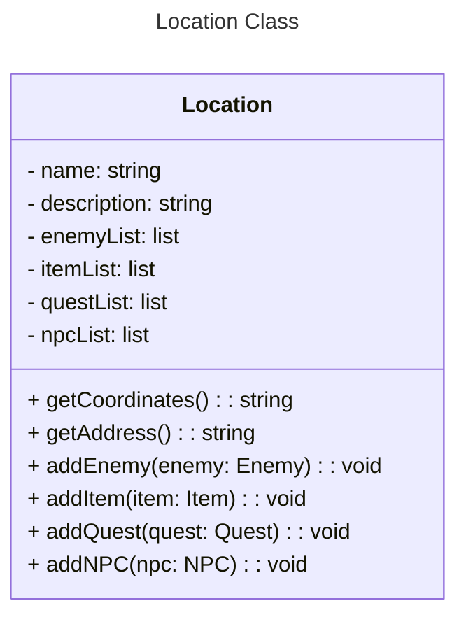

```mermaid
---
title: Location Class
---
classDiagram
    class Location {
        - name: string
        - description: string
        - enemyList: list
        - itemList: list
        - questList: list
        - npcList: list
        
        + getCoordinates(): string
        + getAddress(): string
        + addEnemy(enemy: Enemy): void
        + addItem(item: Item): void
        + addQuest(quest: Quest): void
        + addNPC(npc: NPC): void
       }
```
